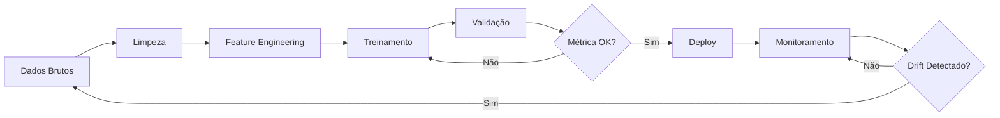

# 🤖 Machine Learning - Lavra.ia

> Modelos de ML em Python para previsões e otimizações

## 📋 Descrição

Módulo de Machine Learning responsável por:
- Treinamento de modelos preditivos
- Inferência em tempo real via FastAPI
- Otimização de portfólio
- Análise de risco
- Processamento de imagens de satélite

## 🛠️ Stack Tecnológica

- **Python** 3.11+
- **PyTorch** 2.x - Deep Learning
- **scikit-learn** 1.3+ - ML tradicional
- **FastAPI** 0.104+ - API de inferência
- **Pandas** - Manipulação de dados
- **NumPy** - Computação numérica
- **Rasterio** - Imagens de satélite
- **MLflow** - Tracking de experimentos
- **DVC** - Versionamento de dados
- **PostgreSQL** - Armazenamento de features

## 🧠 Modelos Implementados

### 1. Previsão de Produtividade 🌾
**Objetivo:** Prever produtividade (sacas/ha) baseado em clima, solo e manejo

**Arquitetura:**
```python
LSTM + Attention
├── Input: Série temporal de 90 dias (clima, estágio da cultura)
├── LSTM layers (2x128 units)
├── Attention mechanism
├── Dense layers (64, 32)
└── Output: Produtividade (mean, std)
```

**Features:**
- Temperatura (min, max, média)
- Precipitação acumulada
- Radiação solar
- Umidade relativa
- Déficit hídrico
- Tipo de solo (embedding)
- Variedade de semente (embedding)
- Estágio fenológico

**Métricas:**
- RMSE: < 3 sacas/ha
- R²: > 0.85
- MAPE: < 8%

---

### 2. Previsão de Preços 💰
**Objetivo:** Prever distribuição de preços futuros de commodities

**Arquitetura:**
```python
Ensemble: ARIMA + LSTM + XGBoost
├── ARIMA: Tendências e sazonalidade
├── LSTM: Padrões não-lineares
├── XGBoost: Features exógenas
└── Ensemble: Weighted average
```

**Features:**
- Histórico de preços (5 anos)
- Volume negociado B3
- Safra mundial (USDA)
- Safra brasileira (CONAB)
- Taxa de câmbio (USD/BRL)
- Preço do petróleo
- Clima global (El Niño/La Niña)

**Output:**
- Distribuição de preços (quantis: 10%, 25%, 50%, 75%, 90%)
- Probabilidade de alta/baixa
- Volatilidade esperada

---

### 3. Classificação de Risco 🎯
**Objetivo:** Score de risco (0-100) por talhão

**Arquitetura:**
```python
Random Forest + Feature Engineering
├── 50 features engineered
├── 200 árvores
├── Max depth: 15
└── Output: Score 0-100 + feature importance
```

**Features:**
- Tipo de solo (10 categorias)
- Histórico de produtividade (5 anos)
- Risco climático (score agregado)
- Pragas históricas
- Infraestrutura (irrigação, drenagem)
- Topografia
- Distância de armazenagem
- Idade do solo (tempo desde última calagem)

**Interpretabilidade:**
- SHAP values para explicar cada previsão
- Feature importance global
- Relatórios automáticos

---

### 4. Otimização de Portfólio 📊
**Objetivo:** Mix ideal de culturas e timing de venda

**Método:**
```python
Programação Linear (PuLP)
├── Variáveis: % de área por cultura, % de hedge por safra
├── Objetivo: Maximizar lucro esperado - λ * risco
├── Restrições:
│   ├── Soma de áreas = 100%
│   ├── Rotação de culturas
│   ├── Capacidade operacional
│   └── Limites de hedge
└── Solver: CBC ou Gurobi
```

---

### 5. Detecção de Anomalias em Imagens de Satélite 🛰️
**Objetivo:** Identificar problemas na lavoura (pragas, déficit hídrico)

**Arquitetura:**
```python
U-Net + ResNet34
├── Input: Imagem Sentinel-2 (13 bandas)
├── Encoder: ResNet34 pré-treinado
├── Decoder: U-Net
└── Output: Segmentação (normal, estresse hídrico, praga, doença)
```

**Features:**
- Bandas visíveis (RGB)
- Bandas NIR (infravermelho próximo)
- NDVI, NDWI, EVI
- Análise temporal (comparação com safras anteriores)

---

## 📁 Estrutura

```
ml/
├── models/                   # Definição dos modelos
│   ├── yield_prediction/
│   │   ├── lstm_model.py
│   │   ├── train.py
│   │   └── config.yaml
│   ├── price_forecasting/
│   │   ├── ensemble_model.py
│   │   ├── train.py
│   │   └── config.yaml
│   ├── risk_classification/
│   │   ├── rf_model.py
│   │   ├── train.py
│   │   └── config.yaml
│   ├── portfolio_optimization/
│   │   ├── optimizer.py
│   │   └── config.yaml
│   └── satellite_anomaly/
│       ├── unet_model.py
│       ├── train.py
│       └── config.yaml
├── training/                 # Scripts de treinamento
│   ├── prepare_data.py
│   ├── train_all.py
│   └── evaluate.py
├── inference/                # API FastAPI
│   ├── app.py               # FastAPI app
│   ├── routers/             # Endpoints
│   │   ├── yield.py
│   │   ├── price.py
│   │   ├── risk.py
│   │   ├── optimization.py
│   │   └── satellite.py
│   ├── schemas/             # Pydantic models
│   └── services/            # Lógica de negócio
├── data/                     # Processamento de dados
│   ├── processors/
│   │   ├── climate.py
│   │   ├── market.py
│   │   └── satellite.py
│   ├── feature_engineering.py
│   └── utils.py
├── notebooks/                # Jupyter notebooks
│   ├── EDA/                 # Análise exploratória
│   ├── experiments/         # Experimentos
│   └── reports/             # Relatórios
├── tests/                    # Testes
├── docker/
│   ├── Dockerfile.training
│   └── Dockerfile.inference
├── requirements.txt
├── setup.py
└── README.md
```

## 🔬 Pipeline de Treinamento



## 📊 Monitoramento de Modelos

**Métricas trackeadas:**
- Acurácia em produção vs. validação
- Data drift (distribuição de features)
- Concept drift (mudanças no target)
- Latência de inferência
- Taxa de erro

**Alertas:**
- Acurácia cai > 5%
- Data drift detectado
- Latência > 2s (p95)

## 🚀 API de Inferência (FastAPI)

```python
# Exemplo de endpoint
@app.post("/predict/yield")
async def predict_yield(request: YieldPredictionRequest):
    """
    Prevê produtividade para um talhão
    
    Body:
    {
        "plot_id": "uuid",
        "climate_forecast": [...],
        "soil_type": "ARGILOSO",
        "variety": "TMG 7062",
        "planting_date": "2025-10-15"
    }
    
    Response:
    {
        "predicted_yield": 68.5,
        "confidence_interval": [62.0, 75.0],
        "confidence": 0.85,
        "factors": {
            "climate_impact": 0.7,
            "soil_quality": 0.9,
            "historical_perf": 0.85
        }
    }
    """
    # Lógica de inferência
    pass
```

## 🚀 Próximos Passos

### Fase 1: MVP (1-2 meses)
1. Setup do ambiente Python
2. Coletar dados históricos (5 anos)
3. Feature engineering inicial
4. Treinar modelo de produtividade (baseline)
5. Treinar modelo de preços (baseline)
6. Criar API FastAPI básica
7. Integrar com backend Go

### Fase 2: Refinamento (2-3 meses)
1. Melhorar arquiteturas (hyperparameter tuning)
2. Adicionar modelo de risco
3. Implementar otimização de portfólio
4. Criar pipeline de treinamento automatizado
5. Setup MLflow para tracking

### Fase 3: Imagens de Satélite (3-4 meses)
1. Download e processamento de imagens Sentinel-2
2. Treinar modelo de detecção de anomalias
3. Integrar com pipeline principal

## 📝 Status

**🚧 EM PLANEJAMENTO** - Aguardando início do desenvolvimento

## 🔗 Dependências

- Dados climáticos do Climate Service
- Dados de mercado do Market Service
- Dados operacionais da API principal
